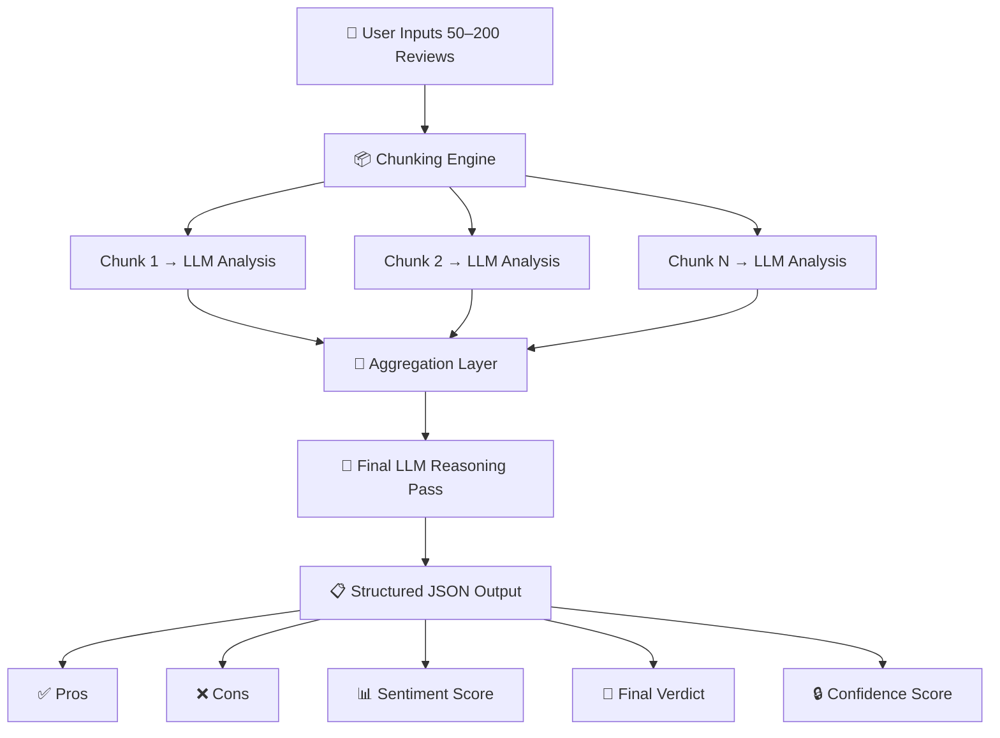
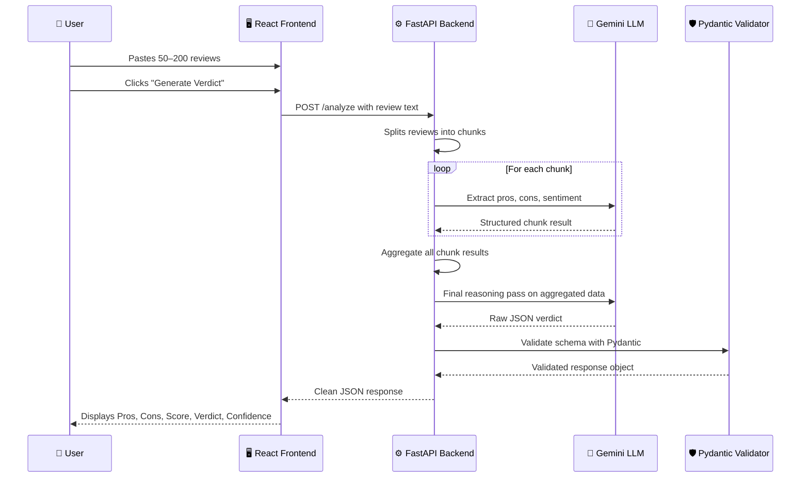

# 🪺 ReviewNest — Smart Review Analyzer

<div align="center">


**An AI-powered review intelligence system that transforms 50–200 raw product reviews into a structured, trustworthy verdict — built for moms who want clarity, not noise.**

[🚀 Live Demo](https://mumzproject.vercel.app/) · [📖 Docs](#️-installation--usage) · [🤝 Contribute](#-future-enhancements)

</div>

---

## 📘 Table of Contents

- [The Problem](#-the-problem)
- [The Solution](#-the-solution)
- [Features](#-features)
- [System Architecture](#-system-architecture)
- [How It Works — The Journey](#-how-it-works--the-journey)
- [Tech Stack](#️-tech-stack)
- [Installation & Usage](#️-installation--usage)
- [Live Deployment](#-deployment)
- [Future Enhancements](#-future-enhancements)
- [LLM Prompts Used](#-llm-prompts-used-to-create-this-project)
- [Author](#-author)

---

## 🧩 The Problem

Imagine you're a mom shopping online for a baby product. You open the product page and see **847 reviews**. Some say it's perfect. Some say it broke in a week. Some are in Arabic. Some are clearly fake. You don't have the time, energy, or tools to read all of them — and you can't afford to make the wrong call.

> **The average online shopper reads only 5–10 reviews before making a decision. That's less than 2% of available feedback.**

This information gap leads to poor purchasing decisions, buyer's remorse, and eroded trust in e-commerce. The star rating alone tells you almost nothing — a 3.8-star product could be beloved by some and dangerous to others, and the only way to know is to read hundreds of reviews you simply don't have time for.

---

## 💡 The Solution

**ReviewNest** is a smart review analysis engine. You paste in a large batch of reviews, and within seconds it gives you:

- A distilled list of **what's actually good** about the product
- A clear breakdown of **what's actually bad**
- A **sentiment score** from 0–100 reflecting overall reception
- A **final human-readable verdict** so you know whether to buy or skip
- A **confidence score** that tells you how reliable this analysis is based on review consistency

No fluff. No fake stars. Just clarity.

---

## ✨ Features

| Feature | Description |
|---|---|
| 📥 **Bulk Review Input** | Accepts 50 to 200 product reviews in a single paste |
| 🤖 **AI-Powered Extraction** | Uses Gemini LLM to extract meaningful pros and cons from messy, unstructured text |
| 📊 **Sentiment Scoring** | Generates a 0–100 sentiment score reflecting the overall reception of the product |
| 🧾 **Structured JSON Output** | All results are returned in a clean, consistent JSON format for predictability |
| 🔒 **Confidence Scoring** | A confidence metric tells you how consistent the reviews are — low confidence = high disagreement among reviewers |
| 🌍 **Multilingual Support** | Natively understands and outputs in both **English** and **Arabic**, using natural phrasing (not literal translation) |
| ⚠️ **Uncertainty Handling** | When reviews are too contradictory or sparse, the system flags this explicitly rather than fabricating a verdict |
| ⚡ **Chunked Processing** | Long review sets are broken into chunks and aggregated — no review left behind, no context window overflowed |

---

## 🏗 System Architecture

The system is designed around a **chunk → analyze → aggregate → verdict** pipeline. Here's a high-level visual:



> The chunking approach solves the LLM context window problem — instead of feeding 200 reviews at once (which would exceed token limits and degrade quality), we process in parallel chunks and intelligently merge the insights.

**Architecture Images:**


---

## 🚶 How It Works — The Journey

Here's what happens from the moment you click **"Generate Verdict"** to the moment you see your results:



### Step-by-Step Breakdown

**Step 1 — Paste Your Reviews**
Copy reviews from any product page — Amazon, Mumzworld, Noon, etc. Paste 50 to 200 reviews into the input panel. The more reviews you provide, the more signal the system has to work with, and the more reliable the final verdict becomes.

**Step 2 — Click Generate Verdict**
One click kicks off the entire pipeline. No configuration, no setup, no prompt engineering needed from the user. The complexity is hidden behind a single button.

**Step 3 — Chunking**
The backend splits your reviews into smaller, manageable chunks. Each chunk fits comfortably within the LLM's context window, ensuring no review is skipped and output quality stays consistent regardless of how many reviews you input.

**Step 4 — Parallel LLM Analysis**
Each chunk is independently analyzed by Gemini. The model is prompted to extract structured pros, cons, and a sentiment signal from each chunk. This is where raw, unstructured opinions become structured data.

**Step 5 — Aggregation**
All per-chunk outputs are merged. Common themes rise to the top. Contradictions are preserved and factored into the confidence score. A final LLM reasoning pass synthesizes everything into a single coherent picture.

**Step 6 — Structured Output Display**

The final result is presented in five clear sections:

- ✅ **Pros** — A prioritized list of the product's genuine strengths, extracted from reviewer consensus. Not marketing copy — actual user-reported benefits, ranked by how frequently they appeared across the review set.

- ❌ **Cons** — Real complaints and recurring issues that multiple reviewers flagged. Each con reflects something that showed up consistently, not a single outlier opinion. This is where you find deal-breakers.

- 📊 **Sentiment Score** — A score from 0 to 100 representing overall reviewer satisfaction. 80+ is strong positive reception. 60–79 is cautiously positive. 40–59 is mixed. Below 40 signals a product with serious recurring problems. Use this as your first gut-check number.

- 🏁 **Final Verdict** — A concise, human-readable recommendation written in plain language. Think of it as a trusted, well-informed friend who read all 200 reviews and is giving you their honest bottom line: *"Worth buying if X, skip if Y."* Bilingual — available in both English and Arabic.

- 🔒 **Confidence Score** — A meta-score that reflects how consistent the reviews are with each other. A high confidence score means reviewers largely agreed — your verdict is reliable. A low confidence score means opinions were polarized, which is itself valuable information: some buyers love it, some hate it, and you now know to dig deeper into *why* before deciding.

---

## 🛠️ Tech Stack

| Layer | Technology | Why |
|---|---|---|
| **Frontend** | React 18 + Tailwind CSS | Component-driven UI, fast iteration, fully responsive by default |
| **Backend** | Python 3.10+ with FastAPI | Async-ready, auto-generates OpenAPI docs, clean and Pythonic |
| **LLM** | Google Gemini | Strong multilingual capabilities, generous context window, reliable structured output |
| **Processing** | Custom chunking + aggregation engine | Handles review volumes beyond LLM context limits without quality loss |
| **Validation** | Pydantic v2 | Enforces strict output schema — no hallucinated fields, no missing keys, no surprises |
| **Deployment** | Vercel (frontend) + Streamlit Cloud (backend) | Zero-config deployments, instant global CDN, free tier friendly |

---

## ⚙️ Installation & Usage

### Prerequisites

- Python 3.10+
- Node.js 18+
- A Gemini API key (set as environment variable `GEMINI_API_KEY`)

### Clone & Run

```bash
# Clone the repository
git clone https://github.com/AryanEjantkar/Mumzproject.git
cd Mumzproject
```

#### Backend

```bash
# Install Python dependencies
pip install -r requirements.txt

# Set your Gemini API key
export GEMINI_API_KEY=your_key_here

# Start the FastAPI server
uvicorn app:app --reload
# Server runs at http://localhost:8000
# Auto-generated API docs available at http://localhost:8000/docs
```

#### Frontend

```bash
cd frontend

# Install Node dependencies
npm install

# Start the development server
npm run dev
# App runs at http://localhost:5173
```

---

## 🌐 Deployment

The application is live and publicly accessible:

**👉 [https://mumzproject.vercel.app/](https://mumzproject.vercel.app/)**

No signup required. Paste reviews and get your verdict instantly.

---

## 🔮 Future Enhancements

The current version is v1 — a focused, single-product analyzer. Here's the roadmap:

- **🔍 Product Comparison Engine** — Analyze two competing products side by side. Get a structured head-to-head comparison of pros, cons, and sentiment scores so you can pick the winner without reading a single review yourself. Ideal for "Product A vs Product B" decisions.

- **🕵️ Fake Review Detection** — A secondary classifier that flags suspicious reviews before they enter the analysis pipeline. Targets common signals: unusually positive language, templated phrasing, unverified purchase badges, and review bursts on specific dates. Cleaner input means a more trustworthy verdict.

- **🎯 Personalized Recommendations** — Build a preference profile based on what matters most to you — durability, ease of use, safety, price-to-value, or portability — and receive verdicts weighted toward your specific priorities rather than aggregate consensus.

- **📈 Advanced Analytics Dashboard** — Sentiment trend charts over time, word clouds of most common complaints, reviewer demographic breakdowns, and category-level benchmarking (how does this product compare to others in the same category?).

- **☁️ Cloud-Based Review Storage** — Save and revisit past analyses. Track how a product's sentiment score changes month over month. Detect quality degradation after a manufacturer change. Build a personal history of products you've researched.

- **🔌 Direct Platform Integration** — A browser extension that runs ReviewNest directly on Amazon, Noon, or Mumzworld product pages — no copy-pasting required. One click, instant verdict, right where you're already shopping.

---

## 🧠 LLM Prompts Used to Create This Project

This project was developed *with* LLMs (Gemini, GPT) as creative and engineering partners — for system design, code generation, evaluation design, and UI ideation. Transparency about this process is intentional: it demonstrates how thoughtful prompt engineering can drive the entire development lifecycle of an AI product.

---

### 1. Project Ideation

> *"Suggest an AI system that summarizes large volumes of product reviews into structured insights (pros, cons, sentiment, verdict, confidence) for e-commerce users, especially moms."*

**What this produced:** The core product concept — the five-output structure (pros, cons, sentiment, verdict, confidence) and the target audience framing around moms as the primary user persona. The LLM suggested that confidence scoring was the differentiating feature that would make the system trustworthy rather than just summarizing.

---

### 2. Architecture Design

> *"Design a scalable pipeline for processing 100+ reviews using chunking, aggregation, and LLM-based summarization. Include validation and confidence scoring."*

**What this produced:** The chunk → analyze → aggregate → verdict pipeline, the decision to use Pydantic for output schema validation, and the confidence scoring concept as a measure of inter-review consistency rather than a simple accuracy metric.

---

### 3. Core Functionality

> *"Write Python code to process large text inputs in chunks, extract key insights (pros/cons), and aggregate them into a final structured output."*

**What this produced:** The chunking engine, the per-chunk LLM prompting logic, and the aggregation function that merges partial insights into a coherent whole while preserving contradictions for the confidence calculation.

---

### 4. UI/UX Design

> *"Design a modern SaaS-style interface for a review summarization tool with sections for input, analysis, and structured output display."*

**What this produced:** The three-panel layout (input → loading state → results), the five-card output structure mapping to each of the five outputs, and the overall visual language of the React frontend including color coding for pros (green) and cons (red).

---

### 5. Multilingual Output

> *"Generate output in both English and Arabic with natural phrasing, not literal translation."*

**What this produced:** The bilingual output system. The critical insight was the phrase *"not literal translation"* — this instructed the model to produce culturally natural Arabic rather than mechanically word-for-word translated text, which made the Arabic output actually useful for native speakers.

---

### 6. Evaluation Design

> *"Suggest evaluation metrics for a review summarization system, including sentiment accuracy, coverage, hallucination detection, and confidence scoring."*

**What this produced:** The full evaluation framework for testing the system — sentiment accuracy benchmarked against human-labeled test sets, coverage metrics (are all major themes from the reviews captured in the output?), hallucination detection (did the LLM invent feedback that wasn't present in the source reviews?), and the confidence scoring rubric tied to reviewer agreement levels.

---

## 👨‍💻 Author

<div align="center">

**Aryan Vimal Ejantkar**

🎓 B.Tech in Artificial Intelligence & Machine Learning — VIT Bhopal
💼 Passionate about AI, ML, and building systems that solve real problems for real people

*Built with curiosity, caffeine, and a genuine desire to make shopping less overwhelming for the people who deserve better tools.*

</div>

---

<div align="center">

⭐ If this project helped you or inspired you, consider giving it a star!

[🚀 Live Demo](https://mumzproject.vercel.app/) · [🐛 Report a Bug](https://github.com/AryanEjantkar/Mumzproject/issues) · [💡 Request a Feature](https://github.com/AryanEjantkar/Mumzproject/issues)

</div>
